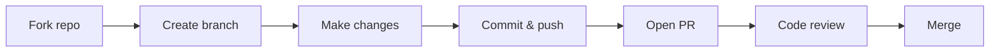

# :material-source-pull: Making Contributions

This guide walks you through the complete contribution workflow — from
creating a branch to getting your pull request merged.

---

## The Fork-and-PR Workflow

Most open-source projects use the **fork-and-pull-request** model:



### Step by step

#### 1. Create a branch

```bash
# Make sure you are on the latest main
git checkout main
git pull upstream main

# Create a feature branch
git checkout -b fix/issue-42-typo-in-readme
```

!!! tip "Branch naming"
    Use the pattern `<type>/<short-description>`:

    - `fix/issue-42-typo-in-readme`
    - `feature/add-export-command`
    - `docs/update-contributing-guide`

#### 2. Make your changes

- Keep changes **focused on a single concern**.
- Follow the project's code style (check for `.editorconfig`, linter configs).
- Write or update tests when changing behaviour.

#### 3. Commit

```bash
git add .
git commit -m "Fix typo in README installation section"
```

!!! info "Good commit messages"
    - **Subject line**: Imperative mood, max ~72 characters
    - **Body** (optional): Explain *why*, not just *what*
    - Reference the issue: `Closes #42` or `Fixes #42`

    ```
    Fix typo in README installation section

    The pip install command had an extra space that caused a copy-paste
    error. Closes #42.
    ```

#### 4. Push and open a PR

```bash
git push origin fix/issue-42-typo-in-readme
```

Then go to GitHub and click **Compare & pull request**.

---

## Writing a Good Pull Request

A well-written PR gets reviewed faster and merged sooner.

### PR description template

```markdown
## What
Brief description of the change.

## Why
Link to the issue or explain the motivation.

## How
High-level summary of the approach.

## Testing
How you verified the changes work.

## Checklist
- [ ] Tests pass locally
- [ ] Lint/format checks pass
- [ ] Documentation updated (if applicable)
```

### Tips

| Do | Avoid |
|----|-------|
| Keep PRs small and focused | Large PRs that change many things |
| Include screenshots for UI changes | Expecting reviewers to run and test |
| Reference the issue number | Opening PRs without context |
| Respond to feedback promptly | Arguing without trying the suggestion |

---

## Code Quality

### Before submitting

1. **Run tests** — Every project has a test command. Find it in the README or
   CONTRIBUTING.md.
2. **Run the linter** — Fix all warnings and errors.
3. **Check formatting** — Many projects use auto-formatters (Prettier, Black,
   dotnet format).

### Common quality gates

| Check | Command examples |
|-------|-----------------|
| Unit tests | `npm test`, `pytest`, `dotnet test` |
| Lint | `npm run lint`, `flake8`, `eslint .` |
| Format | `prettier --check .`, `black --check .` |
| Build | `npm run build`, `dotnet build` |

---

## The Review Process

### What to expect

1. **Automated checks** — CI runs tests, lint, and build automatically.
2. **Reviewer feedback** — Maintainers or other contributors leave comments.
3. **Revision requests** — You may need to make changes. This is normal and
   not a rejection.
4. **Approval and merge** — Once approved, the maintainer merges your PR.

### Responding to feedback

!!! success "Best practices"
    - **Be open** — Reviewers are trying to improve the project, not
      criticise you personally.
    - **Ask questions** — If feedback is unclear, ask for clarification.
    - **Push fixes** — Add new commits to the same branch; the PR updates
      automatically.
    - **Say thank you** — A simple "Thanks for the review!" goes a long way.

### If your PR is not reviewed

If your PR has not received attention after a week:

1. Leave a polite comment: "Friendly ping — is this ready for review?"
2. Check if the project is still actively maintained.
3. Be patient — maintainers are often volunteers with limited time.

---

## Keeping Your Fork in Sync

After your PR is merged (or periodically):

```bash
git checkout main
git pull upstream main
git push origin main
```

This keeps your fork up to date and prevents merge conflicts in future PRs.

---

## Summary

| Step | Action |
|------|--------|
| 1 | Fork and clone the repository |
| 2 | Create a descriptive branch |
| 3 | Make focused, well-tested changes |
| 4 | Write a clear commit message |
| 5 | Open a PR with context and a checklist |
| 6 | Respond to review feedback promptly |
| 7 | Celebrate when it is merged! |
