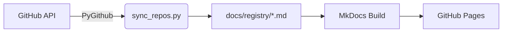

---
hide:
  - toc
---

# :material-power-plug: Power Platform Open-Source Hub

> **A starting point towards the open-source ecosystem related to Power Platform.**

Welcome to the **Intelligence Hub** — a central, community-driven catalogue of
open-source projects powering the Microsoft Power Platform and Copilot Studio
ecosystem.

!!! tip "Quick Start"
    Head to the **[Registry](registry/index.md)** to browse all tracked
    repositories, or visit the **[Guide](guide/index.md)** section for
    contribution best-practices.

---

## What is this project?

The **Power Platform Open-Source Hub** simplifies the discovery of relevant
open-source projects by aggregating repository metadata from GitHub. The data
is refreshed automatically by a Python-based pipeline and rendered into
structured, searchable documentation.

!!! info "Single Source of Truth"
    The Python script [`scripts/sync_repos.py`](https://github.com/rpothin/PowerPlatform-OpenSource-Hub/blob/main/scripts/sync_repos.py)
    is the authoritative data source. It fetches live repository metadata using
    the GitHub API and writes structured Markdown to `docs/registry/`.

---

## At a Glance

| Metric | Value |
|--------|-------|
| **Tracked Repositories** | _auto-populated by sync script_ |
| **Topics Covered** | `powerplatform` · `powerapps` · `powerautomate` · `dataverse` · `dynamics365` · `pcf-controls` · `ai-builder` |
| **Data Pipeline** | Python + PyGithub → Markdown → MkDocs |
| **Hosting** | GitHub Pages via `mkdocs gh-deploy` |

---

## Architecture

!!! note "Stateless Design"
    Every deployment is built from scratch — no database, no server. The
    entire site is a static artefact generated from source-controlled
    Markdown files.

---

## Visual Modes

Toggle between two branded palettes using the :material-weather-sunny: / :material-weather-night: icon in the header.

| Mode | Primary Colour | Accent |
|------|---------------|--------|
| :material-weather-sunny: **Power Green** | Teal `#0d6e6e` | Green `#4ec86c` |
| :material-weather-night: **Copilot Purple** | Deep Purple `#5B2D8E` | Violet `#A855F7` |

---

## Get Involved

!!! success "Contributions Welcome"
    Whether you maintain a Power Platform tool or just want to help curate,
    check the **[Contributing Guide](guide/contributing.md)** to get started.
